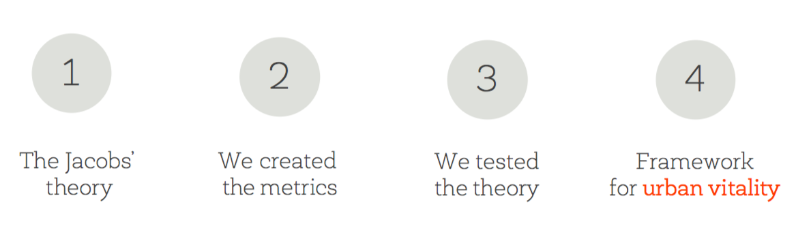

# The Death and Life of Great Italian Cities: A Mobile Phone Data Perspective



  
This repository shows the code to apply the concept of "The Death and Life of Great Italian Cities: A Mobile Phone Data Perspective" into the Italian scenario. Through the code it is possible to reproduce some results, and to see how vitality can be described through the Jane Jacobs' conditions and, thus, the urban built environment. 
  
See the [paper](https://arxiv.org/abs/1603.04012) and the [slides](https://speakerdeck.com/denadai2/the-death-and-life-of-great-italian-cities-a-mobile-phone-data-perspective) for more details.


## Overview
* [data/](data) contains all the data the scripts and the models use.
* [figures/](figures) is the output directory of the images generated by the scripts.
* [generated_files/](generated_files) contains the files generated from the scripts.
* [install/](install) contains some code to build the initial repository.

Please consider citing our [paper](https://arxiv.org/abs/1603.04012) if you use our model or code (see below for citation). We live thanks to this small action you can take!

## Installation

We assume that you're using [Python 3.6](https://www.python.org/downloads/) with [pip](https://pip.pypa.io/en/stable/installing/) installed.

Then we assume these software dependencies:
* [PostgreSQL 10.0](https://www.postgresql.org/) 
* [PostGIS 2.4.1](https://postgis.net) extension
* [intarray](https://www.postgresql.org/docs/10/static/intarray.html) extension
* [osm2pgsql 0.95.0-dev](https://github.com/openstreetmap/osm2pgsql)

Once that's done you need to run the following inside the root directory to install the remaining dependencies:
  
```bash
pip3 install -r install/requirements.txt
```
This will install the following dependencies:
* [numpy](http://www.numpy.org/)
* [pandas](https://pandas.pydata.org/)
* [scipy](https://www.scipy.org/)
* [matplotlib](https://matplotlib.org/)
* [seaborn](https://seaborn.pydata.org/)
* [scikit-learn](https://github.com/scikit-learn/scikit-learn)
* [SQLAlchemy](https://www.sqlalchemy.org/)
* [jupyter](http://jupyter.org/)

### Database initialization

```bash
createdb WWW
psql WWW < install/schema.sql
```

## Run the code with Italian cities

In all the code and files I assume that each city has a code (named `pro_com`) and each neighborhood has an ID called `ace`.


### Census data
First, it is necessary to import the ISTAT census. There are two ways to do it: manually, automatically (suggested!).

#### Manual import

Import all files from https://www.istat.it/it/archivio/104317 ("Censimento della popolazione e delle abitazioni (formato xls-csv)")

First you download everything and unpack. Then you merge all files into a single one, discarding the headers of the CSV.

```bash
{ head -n1 Sezioni\ di\ Censimento/R01_indicatori_2011_sezioni.csv; for f in Sezioni\ di\ Censimento/R*.csv; do tail -n+2 "$f"; done; } > import_ISTAT.csv
```

Then you import the files

```bash
csvsql --db postgresql://localhost:5432/WWW -v -e iso-8859-1 --table istat_indicatori --create-if-not-exists --no-constraints --insert import_ISTAT.csv
```

And you do the same for Censimento dell'industria e dei servizi (formato txt)

```bash
{ head -n1 Dati_SCE_2011/Sez_AttivitaEconomica/01_AttEcon_SCE_2011.txt; for f in Dati_SCE_2011/Sez_AttivitaEconomica/*2011.txt; do tail -n+2 "$f"; done; } > import_ISTAT.csv
```

Now it's time to import the shapefiles. You should download the data from https://www.istat.it/it/archivio/104317 under the subsection "BASI TERRITORIALI", and the column WGS84 2011.

```bash
ogr2ogr -f "PostgreSQL" PG:"host=localhost user=[youruser] dbname=WWW" -nlt GEOMETRY -nln census_areas [path_shapefile_to_import]
```


#### Automatic import

Download the files from https://drive.google.com/drive/folders/1M08jizFSa3SFo8e-SebOIVlj2djM44AO?usp=sharing and place them in `install`. Then: 

```bash
gunzip < install/census_areas.sql.gz | psql WWW
gunzip < install/istat_indicatori.sql.gz | psql WWW
gunzip < install/istat_industria.sql.gz | psql WWW
```

### Boundaries
You need to place some shapefiles that act as boundaries of the city. These shapefiles have to contain one multi-polygon. They have to be placed in `data/shps/boundaries/[cityname].shp`. 
You can create them dissolving the `procom` variable from the shapefiles of the Italian census, or by downloading them from OpenStreetMap. I placed an example of boundary in `data/shps/boundaries/milano.*`.

### Land-use

Download satellite shapefiles from https://land.copernicus.eu/local/urban-atlas/urban-atlas-2012/view. Extract them, and place them into `data/shps/atlas`

### OpenStreetMap

You should download an extract (pbf file) and place it in `data/OSM/[cityname].pbf`. For Italy I suggest http://osm-estratti.wmflabs.org/estratti/.

### Companies

The format of the files to be placed in `data/companies/[cityname].csv` is:
```
long,lat,dimension
9.18886313,45.48014083,piccola
```

### Foursquare

We used Foursquare data to identify the Point Of Interests (POIs) in a city. This can be substituted with other sources of data, like OSM POIs. However, we specified in `install/f4sq_categories.py` the categories we used in Foursquare. We suggest to use [Places API](https://developer.foursquare.com/places-api) to download the data.

The format of the files to be placed in `data/POIs/[cityname].csv` is:
```
lon,lat,category,name,venueID
9.18886313,45.48014083,Art-night,prova,ChIJ0VBVCDZ-44kRYmi7ns98fvw
```

### Mobile phone data

Sadly, we can't share the mobile phone dataset we used. However, there are [similar dataset released in Open Data license](https://www.nature.com/articles/sdata201555).

The original, raw, Call Detail Records have to be processed and put in `generated_files/telco.csv`, with this format:
```
pro_com,ace,avg_activity
82053,40,12652.540506399999
```

### List of cities
You have to specify the list of cities you want to process in `list_cities.csv`, with this format:

```
milano,15146

```

(be careful to put the last, empty, line.

### Run the loader
Whenever you are ready, and you placed all the files in the right directories, you can run configure the loader `load_data.bash` (variables on the top of the file), the loader:

```bash
bash load_data.bash
```

This script will load the data and refresh the materialized views of the database. Then you can run the python scripts :)


## Disclaimer 
This code has been published after the peer-reviewed publication (1 year after it), to publish the code for new developers and researchers. Thus, I am sorry for the small differences you can find, or for the lack of code to reproduce some images. I will refactor it in the future. Although I improved the original code A LOT with new software and scripts that have been released in this year, it has not been optimized for efficiency, but should be fast enough for most purposes. We do not give any guarantees that there are no bugs - use the code on your own responsibility!

## License
This code is licensed under the MIT license. 

## Included datasets
The datasets are uploaded to this repository for convenience purposes only. They were not released by us and we do not claim any rights on them. If you want to use any of the datasets please consider citing the original authors. Sadly, we can't share the mobile phone dataset. However, there are [similar dataset released in Open Data license](https://www.nature.com/articles/sdata201555).

## Citation
```
@inproceedings{DeNadai:2016,
     author = {De Nadai, Marco and Staiano, Jacopo and Larcher, Roberto and Sebe, Nicu and Quercia, Daniele and Lepri, Bruno},
     title = {The Death and Life of Great Italian Cities: A Mobile Phone Data Perspective},
     booktitle = {Proceedings of the 25th International Conference on World Wide Web},
     series = {WWW '16},
     year = {2016},
     isbn = {978-1-4503-4143-1},
     location = {Montr\&\#233;al, Qu\&\#233;bec, Canada},
     pages = {413--423},
     numpages = {11},
     url = {https://doi.org/10.1145/2872427.2883084},
     doi = {10.1145/2872427.2883084},
     acmid = {2883084},
     publisher = {International World Wide Web Conferences Steering Committee},
     address = {Republic and Canton of Geneva, Switzerland},
     keywords = {cities, mobile phone data, open data, urban informatics},
} 
```

